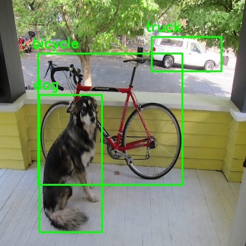

# Object detection using deep learning with OpenCV and Python 
OpenCV `dnn` module supports running inference on pre-trained deep learning models from popular frameworks like Caffe, Torch and TensorFlow. 

When it comes to object detection, popular detection frameworks are
 * YOLO
 * SSD
 * Faster R-CNN
 
 Support for running YOLO/DarkNet has been added to OpenCV dnn module recently. 
 
 ## Dependencies
  * opencv
  * numpy
  
  OpenCV has to be compiled from source from the master branch. 
 
 ## YOLO (You Only Look Once)
 
 `$ python yolo_opencv.py --image dog.jpg --config yolov3.cfg --weights yolov3.weights --classes yolov3.txt`
 
 (Pre-trained YOLO v3 weights file is available [here](https://pjreddie.com/media/files/yolov3.weights).)
 
 ### sample output :
 
 
 
 (**SSD and Faster R-CNN examples will be added soon**)
